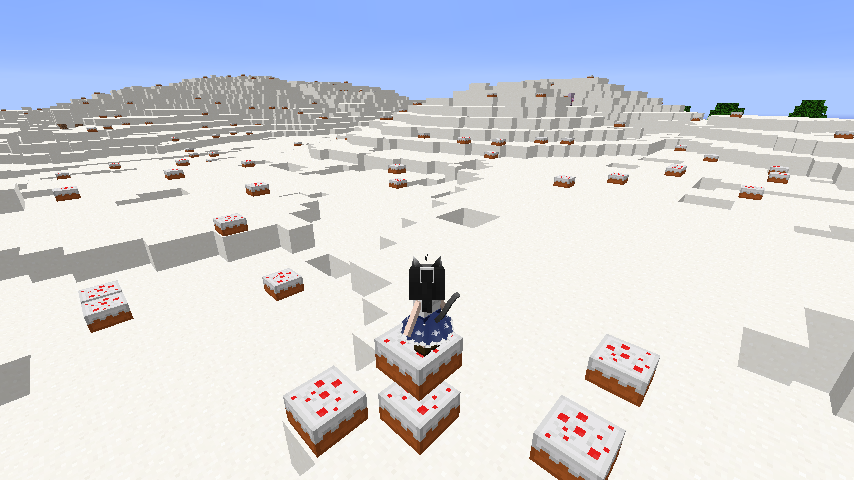

EntityModeSugarBiome(砂糖バイオーム)
====================

メイドさんのお給料に困ったらここ来ればいいね。地盤が弱いので滑落や生き埋めには注意。

## 概要

1. 砂糖４個からクラフトできる「砂糖ブロック」が追加されます
2. 砂糖ブロックで表面が覆われた "SugarLand" バイオームが追加されます
3. メイドさんに、アクティブモード "SugarHunter" が追加されます

## スクリーンショット

## 前提

- Minecraft 1.5.1
- ModLoader 1.5.1
- YMTLib 151v3

前提MODではありませんが、MMM氏製作の「littleMaidMob 1.5.1-1」が導入済みならば、メイドさんがサトウキビ農業に目覚めます。

## 導入

mods に zip のまま放り込んでください。
導入前にバックアップを取るのも忘れずに。".minecraft" 自体をバックアップするのがお手軽です。

## 利用条件

この MOD は Apache License(ver2.0) の下で配布されます。

    http://www.apache.org/licenses/LICENSE-2.0

- この MOD を使用したことにより発生したいかなる結果についても、製作者は一切の責任を負いません。
- この MOD は変更の有無にかかわらず再頒布が可能です。Apache License を確認してください。

この MOD または派生成果物は、それが minecraft を前提としている場合に、
minecraft 自体の利用条件に縛られることに注意してください。
利用条件の詳細は minecraft の利用規約を確認してください。

## レシピ

### 砂糖４個 → 砂糖ブロック
    ▲▲
    ▲▲

### 砂糖ブロック → 砂糖４個
    ■

### 羊毛５個 → スポンジ
    ■　■
    　■　
    ■　■

## Tips

- メイドさんにサトウキビを持たせてアクティブ状態にすると「SugarHunter」モードになります。
- 天然の砂糖ブロックには幸運付きツールが有効です。
- [おまけ機能] ケーキがシルクタッチ付きツールで回収できるようになります。
- [おまけ機能] スポンジが水を吸うようになります。

## Config(mod_SugarBiome.cfg)

    sugarBlockId=203    # 砂糖ブロックのID
    sugarBiomeId=55     # 砂糖バイオームのID
    replaceCake=false   # 既存ケーキの挙動変更を有効化/無効化
    replaceSponge=false # 既存スポンジの挙動変更を有効化/無効化

## Copyright 2013 Yamato

Licensed under the Apache License, Version 2.0 (the "License");
you may not use this file except in compliance with the License.
You may obtain a copy of the License at

    http://www.apache.org/licenses/LICENSE-2.0

Unless required by applicable law or agreed to in writing, software
distributed under the License is distributed on an "AS IS" BASIS,
WITHOUT WARRANTIES OR CONDITIONS OF ANY KIND, either express or implied.
See the License for the specific language governing permissions and
limitations under the License.

## History

- 151v4: 幾つかのバグ修正
- 151v3: 幾つかのバグ修正
- 151v2: 幾つかのバグ修正
- 151v1: Minecraft1.5.1 に対応
- 147v2: 既存ケーキを回収可能に / 既存スポンジが水を吸うように / その他いくつかのバグ修正
- 147v1: 砂糖ブロック / 砂糖バイオーム / メイドさんキビ農家モード
